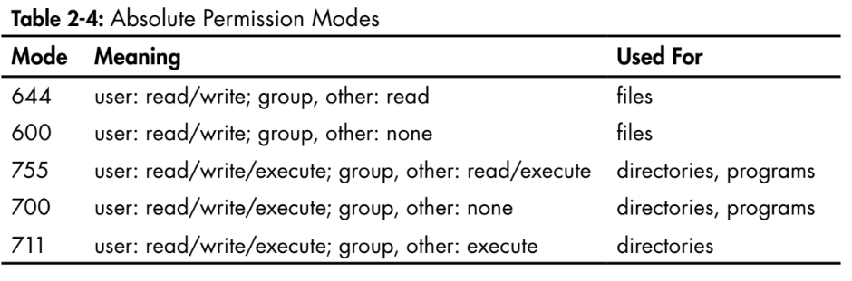

# How Linux works

Author: Brian Ward
Timeline: 2020-10-25 till date.

## Objective

I have been using Linux since 2007, but I have not dived into
the depths of the topic. I would like in-depth Linux Kernel
knowledge, so that I can both appreciate the system better
and be a more powerful developer.

However, I would like objectifiable goals:

1. Be able to analyse system performance.
2. Be able to compile kernels from source and boot them.
3. Be able to edit the grub bootloader config.
4. Be able to debug a running process using syslogs.

The fact that I do not yet know what I would like to do is
proof that I lack definitive knowledge of the system.

## Chapter 1 The Big Picture

The Linux Kernel provides libraries and interfaces with which
programs can interact with devices. Although, as this book
details later, what the Kernel considers to be devices is
quite interesting.

### Process Management

Linux Process Management involves the starting, pausing, resuming
and termination of processes.

Linux processes share compute time by performing operations within
allocated **time slices**. These time slices give processes enough time
for some significant computation, and are extremely small.

This time-sharing is perceived as multi-tasking. And it is called
*context switching*.

Questions I have on the topic:

1. Can kernel time slice lengths be configured?
2. How does a kernel record the status of a process before context-switching?
3. And when ready to context-switch, how does the kernel know which to pick next?
4. What is CPU user mode?
5. How does a process get *interrupted*?
6. What is kernel mode?

The Kernel runs inbetween processes during a context-switch.

### Memory Management

The Commandments for Memory Management

1. The Kernel Keepeth its own private, inaccessible memory space.
2. Unto each process is its own section of memory.
3. Thou shalt not covet thy neighbour's memory space.
4. If thou chooseth, some sections of thine memory may not be altered.
5. The System may useth the disks as though they were like unto memory, should it need to.

### Device Drivers and Management

A device is typically accessible only in Kernel mode, so as to prevent
improper access.

So can I think of *kernel mode* as what the CPU does inbetween
time slices so that it can execute kernel commands? Like when a
process asks to access a disk, the kernel has to respond during
the context switching?

### System Calls and Support

System calls (`syscalls`) perform specific tasks that a user process
alone cannot do well or at all. Opening files, reading or writing to
files, all qualify.

`fork` and `exec` are very important.

`fork` instructs the kernel to create a nearly identical copy of the process.

`exec` instructs the kernel to start a `program` that is passed to
`exec` and replace the current process.

*All* user processes, except `init` start through `fork`. You run `exec`
to start a new program instead of running a copy of an existing
process.

Interestingly, this must be how virtualenvs cannot be sourced within
a shell script. Trying: `ls` in a terminal, the shell calls `fork` to
create copy of the current shell, start this, and then exit.

### User Space

The user-space or `userland` is main memory that the kernel allocates
for user processes.

### Users

A user is an entity that can run processes and own files. A user is
associated with a username, but the kernel uses userids to identify
a user. User space processes are owned by a user, and processes
are run as a user.

`root` is a privileged user which can terminate any other user's
processes and read/write any file on the file system.

`root` might be powerful, but it *still runs in User mode, not kernel
mode*.

Groups are sets of users.

## Basic Commands and Directory Heirarchy

### The Bourne Shell `/bin/sh`

A shell is a program that runs commands. The Bourne Shell, was
developed at Bell Labs. Linux uses the *Bourne-Again shell*,
commonly known as `bash`.

Use `chsh` to change the default shell on a Linux system.

### Using the Shell

`echo` does not need quotes.

`cat` performs concatenations on a list of files or input streams.

#### Standard Input and Standard Output

Unix processes use I/O streams to read and write data. Streams are
very flexible: their source can be a file, a device, a terminal,
or even the output stream from another process.

Using `cat` without an argument puts you into `STDIN` mode, where
`cat` will echo back everything you type into it. When you type,
you are sending inputs to `STDIN`. `cat` reads this and redirects
it to `STDOUT`. (Use CTRL-D to exit).

`CTRL-D` stops `STDIN` input on a terminal, and depending on the
program, terminates it. `CTRL-C` terminates a program, irrespective
of the input or output.

Each process gets an `STDOUT` stream to write to. `cat` writes to
`STDOUT`.

`STDERR` is covered later.

Both these can be *redirected*.

### Basic Commands

Covers standard commands you should already know:
`ls, cp, mv, touch, rm & echo`.

### Navigating Directories

Unix directory hierarchy begins at `/`, called the root dir.
`.` refers to the current diredctory. Paths can be *absolute*
(`/usr/lib`) or *relative* (`code/file1.txt` or `./code/file1.txt`).

Covers `cd, mkdir` and `rmdir`.

The shell natively supports *simple* patterns, or *globs*.
Globs are *expanded before* running the commands.

`*` (match anything, any length), and `?` (match anything, 1 character)
  are the most noteworthy in the beginning.

### Intermediate Commands

Use `grep` to find a string within a directory. Note: *ripgrep* (`rg`)
and *the_silver_searcher* (`ag`) are *much, much faster.*

`grep <find what> <find where>`

Note: If you use shell expansions (globbing) in the `<find what>`
section, these are *expanded first*, and might not be what you want.

`less` provides a scrolling view on `stdout`. `less` is `more`, enhanced.

`less` supports the `/` search mechanism that `vim` uses.

`pwd` prints the current working directory. Use `pwd -P` to resolve
symbolic links as well.

`diff` is used to spot the differences between 2 files.
`diff -u` provides a way for other programs to analyse the output.

`file` can be used to guess the *file type* of a given file.

`find <directory> -name <filename> -print` can be used to find a
certain file in a directory tree. Remember, if you must use `*`,
enclose it in `''` quotes. `find <directory> -iname <filename>`
will turn off case-sensitivity.

`locate` uses a cached file index for a file, and is faster
for this reason. However, if the file is newer than the index,
`locate` won't find it.

`head` and `tail` return the top and bottom `n` lines of a stream
respectively. `head -<n>` will show `<n>` number of lines.
`tail +<n>` will print everything from line number `<n>`.

### Changing Your Password and Shell

`passwd` can change the password, and `chsh` can change the default
shell.

### Dot Files

Files beginning with a `.` are *configuration* files.
Linux programs use text based files for configuration.

### Environment and Shell Variables

`STUFF=blah` is how you assign a value to a variable in the shell.
*Note the absence of spaces around the `=`*. A shell variable is
local to the current process. However, an environment variable is
passed to processes spawned by this process as well.

Note that *all* environment variables are passed to child processes.


#### Child Processes and Inherited Environments

This creates interesting problems, such as needing to start a Python2
process from a Python3 environment. If you activate a virtualenv
and use `subprocess.check_output` to run `python`, the default Python
will be the same as the parent process (Python 3 here). If you
have a weird use case where you would want to do this, ensure you *don't*
source the *virtualenv*, instead, run the parent python script
using the *absolute path* to the virtual environment's python
executable (found in `<envdir>/bin/python`). Again, note that
this is not the Python executable that was used to make the virtualenv.

### The Command Path

`PATH` is a very important Environment variable. It contains a `:`
separated list of directories where the current shell will search
for commands.

This is an interesting scenario. Carefully, try `export PATH=`,
to clear the value of `PATH`. Now try running commands you've learnt
so far. If they execute, these are native unix commands. If they do not,
these are binaries that were possibly available in some of the library
folders such as `/usr/bin`, `/usr/local/bin` or `/bin`.

When appending to the path, use `export PATH=$PATH:<dir>`.

### Command-Line Editing

The default is `emacs` mode. Sacrilege. Turn on `vi mode`.

### Text Editors

"[vi] plays a bit like a video game." LOL.

### Getting Online Help

`man -k <keyword>` can be used when you want to search for a manual
page by a keyword.

`man <section> command` can go to a section of a command.

#### `man` sections

1. User commands
2. System calls
3. Higher-level Unix programming library documentation
4. Device interface and driver information
5. File descriptions (system configuration files)
6. Games
7. File formats, conventions, and encodings (ASCII, suffixes, and so on)
8. System commands and servers

`info` is a more detailed format for online manuals, adopted by the GNU Project.

Documentation can be sometimes found in `/usr/share/doc`. However, `man`
and `info` do not read these.

### Shell Input and Output

`command > file` can send the output of a file to a file, *clobbering* (erasing) the
contents of the original file. `set -C` can prevent clobbering in bash.

`command >> file` can append the output to the file.

`command1 | command2` streams the `stdout` of `command1` to
the `stdin` of `command2`.

#### Standard Error

`STDERR` is an error stream. To redirect this, you need to use *stream II*
by using `command 2> file`. To send `STDERR` to `STDOUT`, send
it to the address of `stream 1`.

`command 2>&1` merges both streams.

`command > file 2>&1` will send both streams to a file.

#### Standard Input Redirection

`command < input` will send `input` to the `command` through `STDIN`.

### Understanding Error Messages

#### Anatomy of a UNIX Error Message

Protip: Address errors on a first-come, first-serve basis.

Errors will have the following components:

1. The program name
2. The file name
3. The error

Example:

```bash
$ ls /asdkl

ls: cannot access /asdkl: No such file or directory
```

#### Common Errors

1. No such file or directory
2. File exists
3. Not a directory, Is a directory
4. No space left on device
5. Permission denied
6. Operation not permitted
7. Segmentation fault

### Listing and Manipulating Processes

A process is a running program.

#### `ps`

`ps` is used to list processes.

`ps x`: show all of your running processes.

`ps ax`: show all processes on the system.

`ps u`: include more detailed information.

`ps w`: show full command names.

#### Killing Processes

A processes can be *killed* using a *signal* from the Kernel.
Use the `kill` command to send signals. A signal is a message
that the kernel sends to a process.

`kill <pid>` send the `TERM` signal to a process. This signal
tells the process that it needs to quit, and gives it time for
any cleanup, if needed.

`kill -STOP <pid>` *freezes* a process. This way, the process can be
resumed.

`kill -CONT <pid>` continues/resumes a frozen process.

`kill -KILL <pid>` is the most brutal way to kill a process. This
will end the process without waiting for any cleanup.

#### Job Control

Shells also support Job Control, a way to send `TSTP` (similar to `STOP`)
to a running process in the foreground using `^Z`, and `CONT` using
the `fg` (bring to foreground) or `bg` (continue in background) commands.

`screen` and `tmux` are good choices of programs to send noninteractive
programs to the background.

#### Background Processes

Send any command directly to the background by suffixing the command
with `&` before running it.

Note that when sending a process to the background, it is always
preferred to ensure that the `stdout` and `stdin` are remapped.

If spurious output from backgroun processes gets in your way, learn how to
redraw the content of your terminal window. The `bash` shell and most
full-screen interactive programs support `C-l' to redraw the entire
screen. If the program is reading from `stdin`, `C-r` usually redraws the
current line, but pressing the wong sequence at the wrong time can leave you in an
even worse situation than before. For example, pressing `C-r` at the
`bash` prompt puts you in reverse `isearch` mode

### File Modes and Permissions

Every Unix file has a set of permissions that determine whether a user
can read, write, or run that file. Use `ls -l` to view this information.

For example:

`-rw-r--r-- 1 juser somegroup 7041 Mar 26 19:34 endnotes.html`

The mode, the first string, represents the file's permissions and some
extra information.


The file **type** indicates what this is. `-` indicates a *regular* file.
`d` indicates a directory. There are other types which will come up
later.

The rest of it can be summed up as groups of 3: `[rwx]`, using `-` where
inapplicable. The permission bits indicate what rights the user(s)
in question has. The first set is the owner, the second is the group
members, the third group is everyone else.

Protip: Use `groups` to figure out what groups your userid belongs to.

#### Modifying Permissions

`chmod a+r <file>` will give everyone *read* permissions on the file.

`chmod o+r <file>` will give other users (not owner and not group members)
*read* permissions on the file.

`chmod +rwx <file>` will give the user *all* permissions on the file.

`chmod g+rx <file>` will give the group members *read and execute* permissions on the file.

`chmod g-x <file>` will *remove* *execute* access from group members.

`chmod o-r <file>` will *remove* *read* access from other users.

Although you *can* use numbers to set the direct permissions, this is
much easier to read.



The numbers are *octal* representation of the permission bits.

#### Symbolic Links

A symbolic link is *like* a shortcut to another file, the difference from the Windows
implementation being that it can be read directly and appears as an entry in the location.

When inspecting the file using `ls -l`,  you might notice that the type of the file is `l`,
indicating that it is a `link`.

Note that the names and the paths to which Symbolic links point t o do not have to exist.

Use:

`ln -s target linkname`

to create a Symbolic link.

One way to remember this is

`link <this> as <that>`.

If you omit the `-s` flag indicating that it's *symbolic*, you create a *hard link*.


### Archiving and Compressing Files

#### `gzip`

GNU Zip is a Unix compression program.

`gzip file` will compress the file *and* deletes the original unless you use the `-k` flag.
The output file will be `file.gz`.

To extract the file, use `gunzip`.

`gzip` only compresses *individual* files. It will not archive more than one.

#### `tar`

`tar` is used when one wants to compress a set of files instead.

```bash
tar cvf archive.tar file1 file2 ... filen
```

will create an `archive.tar` file that contains all the files.

`c` indicates compression, `v` is verbosity for the diagnostic output, and `f` indicates that you'd like to specify the filename.

To unpack, use `tar xvf archive.tar`

`tar` doesn't purge the inputs or the extracted file after it does what it needs to.

To verify the table of contents of a `tar` file, use `tar tvf`, where `t` indicates
`table-of-contents`-mode.

`p` keeps the permissions. It is included in defaults when operating as a `super` user.


#### `.tar.gz`

After a bunch of files is archived, it is common practice to *compress* them using `gzip`.

So you'd probably do this:

```bash
tar cvf archive.tar file1 file2 file3
gzip archive.tar
```
And this results in an `archive.tar.gz` file.


To extract, just do the reverse.

```bash
gunzip archive.tar.gzz
tar xvf archive.tar
```

This is so common that `zcat` exists.


```bash
zcat file.tar.gz | tar xvf -
```

`zcat` is the same as `gunzip -dc`, which decompresses and sends the output to `stdout`.

However, this is made easier with the `z` flag to the `tar` command.

```bash
tar xvzf file.tar.gz
```

will decompress and extract the compressed archive.

To make one, use

#### Other Compression Utilities

`bzip2` deals with `.bz2`, and compacts text files a little better. Use `bunzip2` to decompress. Use `j` to use `bzip2` with `tar`

`xz` is new, and its corollary is `unxz`.

`zip` and `unzip` also exist, for Windows compatibility. They will also extract self-extracting
`exe` files.

`.Z` is a relic made using `compress`. `gunzip` can extract them, but `gzip` will not
create them.

### Linux Directory Heirarchy Essentials


1. `/bin` Contains ready-to-run programs (also known as an executables),
including most of the basic Unix commands such as ls and cp . Most of
the programs in /bin are in binary format, having been created by a C
compiler, but some are shell scripts in modern systems.
2. `/dev` Contains device files. You’ll learn more about these in Chapter 3.
3. `/etc` This core system configuration directory (pronounced EHT-see)
contains the user password, boot, device, networking, and other setup
files. Many items in `/etc` are specific to the machine’s hardware. For
example, the `/etc/X11` directory contains graphics card and window sys-
tem configurations.
4. `/home` is where the heart is.
5. `/lib` An abbreviation for library, this directory holds library files con-
taining code that executables can use. There are two types of libraries:
static and shared. The `/lib` directory should contain only shared librar-
ies, but other lib directories, such as `/usr/lib`, contain both varieties as
well as other auxiliary files.
6. `/proc` Provides system statistics through a browsable directory-and-file
interface. Much of the `/proc` subdirectory structure on Linux is unique,
but many other Unix variants have similar features. The `/proc` directory
contains information about currently running processes as well as some
kernel parameters.
7. `/sys` This directory is similar to /proc in that it provides a device and
system interface.
8. `/sbin` The place for system executables. Programs in /sbin directories
relate to system management, so regular users usually do not have /sbin
components in their command paths. Many of the utilities found here
will not work if you’re not running them as root.
9. `/tmp` Temporary storage that is wiped on boot and perhaps periodically.
10.  `/usr` Although pronounced “user,” this subdirectory has no user files.
Instead, it contains a large directory hierarchy, including the bulk of
the Linux system. Many of the directory names in /usr are the same as
those in the root directory (like /usr/bin and /usr/lib), and they hold the
same type of files. (The reason that the root directory does not contain
the complete system is primarily historic—in the past, it was to keep
space requirements low for the root.)
11. `/var` The variable subdirectory, where programs record runtime infor-
mation. System logging, user tracking, caches, and other files that system
programs create and manage are here. (You’ll notice a /var/tmp directory
here, but the system doesn’t wipe it on boot.)

#### Other Root Subdirectories

1. `/boot` Contains kernel boot loader files. These files pertain only to
the very first stage of the Linux startup procedure; you won’t find
information about how Linux starts up its services in this directory.
2. `/media` A base attachment point for removable media.
3. `/opt` This may contain additional third-party software. Many systems
don’t use `/opt`.

#### `/usr`

In addition to `/usr/bin`, `/usr/sbin` and `/usr/lib`, `/usr` contains:

1. `/usr/include` holds header files used by the C compiler.
2. `/usr/info` GNU info manuals
3. `/usr/local` admins can install their own software here. Keeps a similar structure to `/` or `/usr` itself.
4. `/usr/man` manual pages
5. `/usr/share` contains files that should work on other kinds of Unix machines with no loss of functionality. In the past, ohter machines would share this directory, but these days, this is not doable. Other `/man`, `info` etc are often found here.

#### Kernel Location

The Kernel is in `/vimlinuz` or `/boot/vmlinuz`. A boot loader loads this file into memory and sets it in motion when the system boots.

Once loaded into memory, the main kernel file is no longer used by the running system. However,
the kernel can load and unload many modules on demand. These are *loadable kernel modules* and are stored in `/lib/modules`.


### Running Commands as the Superuser

#### `sudo`

Sudo is a *package* distributed by most larger distros to allow admins to run commands as root when they're logged in as themselves.

`vipw` is a command to edit the `/etc/passwd` file.

When `sudo` is called, this action is logged with the syslog service under `local2`.


#### `/etc/sudoers`

This file controls who can run `sudo`.

Use `visudo` to edit this file.


## Devices

### Device Files

The kernel presents many of the device I/O interfaces as files. These are sometimes called *device nodes*. *Some* of these files are also accessible to standard programs like `cat`.

Linux uses the same design for device files as do other Unix flavors. Devices go into `/dev`.

`ls /dev` lists all the devices in the system.


`/dev/null` is a device. The Kernel decides what to do with any inputs to a device.

`echo blah blah > /dev/null` will not print anything because `/dev/null` is a device that the
Kernel knows to ignore.

To identify a device, use `ls -l` and notice the first character.

```bash
$ ls -l /dev/

crw-r--r--  10,235 root            27 Dec 22:46 autofs
drwxr-xr-x       - root            27 Dec 22:46 block
crw-rw----  10,234 root            27 Dec 22:46 btrfs-control
drwxr-xr-x       - root            27 Dec 22:46 bus
drwxr-xr-x       - root            27 Dec 22:46 char
crw--w----     5,1 root            27 Dec 22:46 console
lrwxrwxrwx      11 root            27 Dec 22:46 core -> /proc/kcore
drwxr-xr-x       - root            27 Dec 22:46 cpu
crw-------   10,59 root            27 Dec 22:46 cpu_dma_latency
crw-------  10,203 root            27 Dec 22:46 cuse
...
```

This first character of the file's mode indicates what the file is. Devices use `b, c, p` or `s`. These stand for block, character, piple and socket.

#### Block Device

Programs access data from a block device in fixed chunks. Your hard drive is a block device. Processes have random access to any block in such devices with the help of the kernel since a block device's total size is fixed and easy to index.


#### Character device

These work with datastreams. You can only read characters from or write characters to these.
`/dev/null` is such a device. These devices usually don't have a size. Printers attached to your computer are represented by character devices. The kernel cannot backup and reexamine the data stream after it has passed data to a device or process during character device interaction.


#### Pipe device

Named pipes are like character devices with another process at the end of the I/O stream instead of a kernel driver

#### Socket Device

Sockets are special purpose interfaces that are frequently used for interprocess communication. They are often found outside of `/dev`. They represent Unix domain sockets.

Not all devices have device files because the block and character device I/O interfaces are not appropriate in all cases. Network interfaces, for example, don't have device files.


### The `sysfs` device path

## Later Reading

1. Operating System Concepts by Abraham Silberschatz et. al.
2. Modern Operating Systems by Andrew S. Tanenbaum et al.
3. The Linux Command Line, No Starch Press
4. UNIX for the Impatient, Addison-Wesley Professional
6. Learning the UNIX Operating System, O'Reilly
7. Mastering Regular Expressions, O'Reilly
8. Programming Perl, O'Reilly
9. Introduction to Automata Theory, Languages, and Computation, O'Reilly.
10. Learning the vi and Vim Editors: Unix Text Processing, O'Reilly
11. GNU Emacs Manual
12. [Filesystem Heirarchy Standards or FHS](http://www.pathname.com/fhs/)
